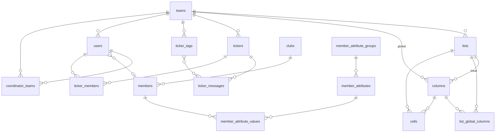

# Team Manager

Mobile-first Webanwendung zur Verwaltung von Sportteams. Koordinatoren legen Listen mit frei definierbaren Spalten an, Mitglieder tragen ihre eigenen Daten ein, und eine Statistikseite fasst die Kennzahlen pro Mitglied zusammen. Listen mit Datum, Uhrzeit und Ort erscheinen in einer Kalenderansicht (Woche/Monat/Liste) — inklusive Token-geschütztem ICS-Abo für Gerätekalender.

**Stack:** PHP 8.3 · PostgreSQL 15 · Bootstrap 5 · kein Framework

---

## Datenmodell

Die Anwendung gliedert sich in vier Bereiche: Teamverwaltung, Listen/Spalten/Zellen (EAV), Live-Ticker und Mitgliedsprofile.



| Relation | Beschreibung |
|----------|-------------|
| `teams → users` | Ein Team hat mehrere Koordinatoren und Mitglieder; `users.team_id` gibt das Ursprungsteam an. |
| `teams → coordinator_teams ← users` | Koordinatoren können mehreren Teams zugeordnet sein; `coordinator_teams` ist die Wahrheitsquelle für aktive Zugehörigkeiten. |
| `users → members` | Jeder Benutzeraccount ist mit einem dauerhaften Mitgliedsprofil verknüpft, das teamübergreifend gültig ist. |
| `clubs → members` | Ein Verein bündelt Mitglieder; ein Mitglied gehört optional zu genau einem Verein. |
| `teams → lists` | Ein Team verwaltet beliebig viele Listen (z. B. Trainings, Spiele). |
| `lists → columns (lokal)` | Lokale Spalten (`columns.list_id IS NOT NULL`) gehören ausschließlich zu einer Liste und können vom Typ Text, Zahl oder Ja/Nein sein. |
| `teams → columns (global)` | Globale Spalten (`list_id IS NULL`) stehen teamweit zur Verfügung; Systemspalten (`team_id IS NULL`, `is_system = TRUE`) gelten für alle Teams. |
| `list_global_columns` | Steuert, welche globalen/System-Spalten in welcher Liste aktiv sind; Entfernen löscht die zugehörigen Zellen. |
| `lists + columns → cells` | Speichert EAV-Werte: eine Zeile pro (Liste, Spalte, Mitglied); der Wert wird als `TEXT` abgelegt und per `data_type` interpretiert. |
| `teams → tickers` | Ein Team kann mehrere Live-Ticker führen (z. B. pro Spiel). |
| `tickers → ticker_messages` | Nachrichten werden chronologisch einem Ticker zugeordnet und können optional einen Tag tragen. |
| `tickers → ticker_members ← users` | Steuert, welche Mitglieder Schreibzugriff auf einen Ticker haben. |
| `member_attribute_groups → member_attributes → member_attribute_values ← members` | Flexible EAV-Erweiterung des Mitgliedsprofils: Attributgruppen fassen Felder zusammen; Werte werden pro Mitglied gespeichert. |

---

## Dev-Umgebung (Docker)

### Voraussetzungen

- [Docker Desktop](https://www.docker.com/products/docker-desktop/) ≥ 4.x

### Starten

```bash
docker compose up --build
```

Die App ist danach unter **http://localhost:8080** erreichbar.

Beim ersten Start:
- PostgreSQL initialisiert die Datenbank und legt das Schema `team_manager` an
- Der App-Benutzer `team_app` wird mit den nötigen Berechtigungen angelegt
- Der Admin-Passwort-Hash wird automatisch aus `ADMIN_PASSWORD` generiert

### Login

| Rolle | Benutzername | Passwort |
|-------|-------------|---------|
| Admin | `admin` | `admin123` |
| Koordinator | (im Admin-Panel anlegen) | (im Admin-Panel setzen) |
| Mitglied | (vom Koordinator anlegen) | (vom Koordinator setzen) |

Admin-Zugangsdaten werden in [.env.docker](.env.docker) konfiguriert.

### Services

| Service | Image | Port |
|---------|-------|------|
| nginx | nginx:1.25-alpine | 8080 → 80 |
| php | php:8.3-fpm-alpine | intern (9000) |
| db | postgres:15-alpine | intern (5432) |

### Datenbank zurücksetzen

```bash
docker compose down -v && docker compose up
```

`-v` löscht das Postgres-Volume — die Initialisierungsskripte laufen beim nächsten Start neu durch.

### Konfiguration

Alle Umgebungsvariablen für die Dev-Umgebung stehen in [.env.docker](.env.docker):

| Variable | Beschreibung | Standard |
|----------|-------------|---------|
| `DB_NAME` | Datenbankname | `team_manager_db` |
| `DB_SCHEMA` | PostgreSQL-Schema | `team_manager` |
| `DB_USER` | App-Datenbankbenutzer | `team_app` |
| `DB_PASS` | Passwort des App-Benutzers | `team_app_dev` |
| `ADMIN_USERNAME` | Admin-Benutzername | `admin` |
| `ADMIN_PASSWORD` | Klartextpasswort (wird beim Start gehasht) | `admin123` |
| `APP_ENV` | Umgebung | `development` |
| `MAIL_DRIVER` | E-Mail-Versand: `mail` (PHP mail()) oder `smtp` | `mail` |
| `MAIL_FROM_ADDRESS` | Absenderadresse | `noreply@localhost` |
| `MAIL_FROM_NAME` | Absendername | `Team Manager` |
| `MAIL_HOST` | SMTP-Host (nur bei `MAIL_DRIVER=smtp`) | — |
| `MAIL_PORT` | SMTP-Port (nur bei `MAIL_DRIVER=smtp`) | `587` |
| `MAIL_USERNAME` | SMTP-Benutzername (nur bei `MAIL_DRIVER=smtp`) | — |
| `MAIL_PASSWORD` | SMTP-Passwort (nur bei `MAIL_DRIVER=smtp`) | — |

### Datenbankstruktur

Die SQL-Dateien unter `database/` werden beim ersten Start in dieser Reihenfolge ausgeführt:

| Datei | Inhalt |
|-------|--------|
| `docker/postgres/01-user.sql` | Legt den App-Benutzer `team_app` an |
| `database/schema.sql` | Erstellt Schema `team_manager` und alle Tabellen |
| `database/rls_policies.sql` | Aktiviert Row-Level Security auf `users` |
| `docker/postgres/04-grants.sql` | Erteilt `team_app` die nötigen Rechte |

**Hinweis zur Row-Level Security:** Die App verbindet sich als `team_app` (kein Superuser), damit RLS greift. Admin-Requests setzen `app.is_admin = true`, Koordinator/Mitglied-Requests setzen `app.current_team_id`.

**Hinweis zu selbst-initialisierenden Tabellen:** Die Tabellen `files` und `free_list_rows` werden beim ersten Seitenaufruf automatisch per `IF NOT EXISTS` angelegt (via Self-Init in den Handlern), nicht über `schema.sql`.

---

## Deployment (Hetzner Webhosting)

### Serverstruktur

```
~/                              (FTP-Home)
└── public_html/
    └── team-manager/           ← Subdomain-Webroot (alle Quelldateien liegen hier)
        ├── index.php           (aus public/)
        ├── .htaccess           (aus public/)
        ├── config.php          ← Zugangsdaten (einmalig anlegen, nie überschreiben)
        ├── src/
        ├── database/
        └── uploads/
```

### Ersteinrichtung

**1. Subdomain anlegen** (Hetzner Konsole) mit Webroot `public_html/team-manager/`.

**2. config.php anlegen** — per FTP nach `public_html/team-manager/config.php` hochladen und Zugangsdaten eintragen:

```php
<?php
define('ADMIN_USERNAME',     'admin');
define('ADMIN_PASSWORD_HASH', password_hash('IhrPasswort', PASSWORD_BCRYPT, ['cost' => 12]));

define('DB_HOST',   'localhost');
define('DB_PORT',   '5432');
define('DB_NAME',   'ihre_datenbank');
define('DB_SCHEMA', 'team_manager');
define('DB_USER',   'ihr_db_benutzer');
define('DB_PASS',   'ihr_db_passwort');

define('SESSION_TIMEOUT', 8 * 60 * 60);
define('APP_ENV', 'production');
define('BASE_URL', '');

define('MAIL_DRIVER',       'smtp');          // 'mail' oder 'smtp'
define('MAIL_FROM_ADDRESS', 'team@ihre-domain.de');
define('MAIL_FROM_NAME',    'Team Manager');
// Nur bei MAIL_DRIVER=smtp:
define('MAIL_HOST',     'mail.ihre-domain.de');
define('MAIL_PORT',     587);
define('MAIL_USERNAME', 'ihr-smtp-benutzer');
define('MAIL_PASSWORD', 'ihr-smtp-passwort');
```

**3. Deployment konfigurieren** — `deploy.sh` liest seine Einstellungen ausschließlich aus
Umgebungsvariablen, niemals aus Kommandozeilen-Argumenten. Argumente wären für andere
Benutzer des Rechners via `ps` sichtbar und landen in der Shell-History.

Am einfachsten über eine Datei `.env.deploy` im Projektverzeichnis (ist in `.gitignore`
und wird nicht mit hochgeladen):

```bash
FTP_HOST=ftp.ihre-domain.de
FTP_USER=ihr-benutzer
FTP_DIR=public_html/team-manager
# FTP_PASS=...   # optional — ohne Eintrag wird verdeckt abgefragt
```

**4. Dateien hochladen:**

```bash
./deploy.sh
```

Erfordert `lftp`: `brew install lftp` (macOS) oder `apt install lftp` (Linux).

**5. Erste Anfrage** — beim ersten Seitenaufruf wird das Datenbankschema automatisch
angelegt (nur bei einer leeren Datenbank).

### Folge-Deployments

```bash
./deploy.sh
```

`config.php` wird nie überschrieben.

> **Wichtig:** Schema-Änderungen werden **nicht** mehr automatisch angewendet. Die App
> führt zur Laufzeit keine Migrationen aus. Liegt in `database/migrations/` ein Skript,
> das noch nicht eingespielt wurde, muss es **vor** dem Deployment einmalig von Hand
> gegen die Produktionsdatenbank ausgeführt werden — sonst greifen die neuen Handler auf
> Spalten zu, die es noch nicht gibt. Details unter [Datenbank-Migrationen](#datenbank-migrationen).

---

## Datenbank-Migrationen

Die App führt zur Laufzeit **keine** Migrationen aus. Beim ersten Seitenaufruf gegen eine
leere Datenbank wird das Schema aus `db_init_schema()` angelegt — das ist alles. Bestehende
Datenbanken werden nie automatisch verändert.

Schema-Änderungen liegen als nummerierte SQL-Skripte in `database/migrations/` und werden
einmalig von Hand eingespielt, **bevor** die zugehörige Code-Version deployed wird:

```bash
psql -h <host> -U <eigentümer> -d <datenbank> -f database/migrations/<skript>.sql
```

Zu beachten:

- **Schema-Name:** In Produktion heißt das Schema `manager`, in Docker/Dev `team_manager`.
  Die Skripte sind auf `manager` geschrieben — für lokal entsprechend anpassen.
- **RLS:** Jede Tabelle hat Row-Level-Security-Richtlinien, die
  `current_setting('app.is_admin', true) = 'true'` prüfen. Ohne ein einleitendes
  `SET app.is_admin = true;` betreffen `UPDATE`/`DELETE` kommentarlos 0 Zeilen.
- **Rechte:** `ALTER`/`DROP` benötigen den Tabelleneigentümer; der App-Datenbankbenutzer
  hat diese Rechte nicht.
- **Reihenfolge:** Erst migrieren, dann deployen. Umgekehrt greifen die neuen Handler auf
  Spalten zu, die noch nicht existieren — das Ergebnis sind HTTP 500 auf den betroffenen Seiten.

---

## Kalender-Abo (ICS)

Termine lassen sich in Apple Kalender, Google Calendar oder Outlook abonnieren. Der Feed ist
**nicht öffentlich**, sondern über ein Token in der URL geschützt: `/ics/{token}.ics`.

Pro Team existieren genau **zwei** Tokens, gespeichert auf der Tabelle `teams`:

| Token | Spalte | Sichtbarkeit |
|-------|--------|--------------|
| Koordinator-Feed | `calendar_token_coordinator` | Listen: öffentlich, geschützt und privat · Termine: geschützt und privat |
| Mitglieder-Feed | `calendar_token_member` | Listen: öffentlich und geschützt · Termine: nur geschützt |

Die Rolle ergibt sich ausschließlich daraus, **welche Spalte** auf das Token passt — sie kann
nicht über einen Request-Parameter beeinflusst werden.

Den Link findet man jeweils unten auf der Kalenderansicht (`/coordinator/lists`
bzw. `/member/lists`). Koordinatoren können beide Tokens unter „Mein Profil" neu erzeugen,
falls ein Link öffentlich geworden ist.

> **Hinweis:** Die Tokens gelten teamweit, nicht pro Person. Ein erneuertes Token macht das
> Abo für **alle** Abonnenten dieses Feeds ungültig — alle müssen den Link neu eintragen.

---

## Installation auf dem Startbildschirm (PWA)

Die App liefert ein Web App Manifest (`public/manifest.webmanifest`) und einen Icon-Satz aus,
lässt sich also unter Android und iOS zum Startbildschirm hinzufügen und startet dann ohne
Browser-Leiste.

Bewusst **ohne** Service Worker: Das Deployment läuft per FTP ohne Build-Schritt, es gibt also
kein Cache-Busting über Dateinamen. Ein Cache würde Nutzer dauerhaft auf veralteten Stylesheets
festhalten. Folge: Chrome zeigt keinen automatischen Installations-Dialog — die Installation
läuft über das Browser-Menü. Unter iOS war das ohnehin immer so.

Icons werden aus einem Skript erzeugt und sind reproduzierbar:

```bash
php bin/generate-pwa-icons.php
```

---

## Deployment (Docker-Container)

Für Server-Umgebungen mit Docker-Unterstützung (VPS, Root-Server, etc.). Verwendet dieselbe `docker-compose.yml` wie die Dev-Umgebung — nur die Umgebungsvariablen werden ausgetauscht.

**Zwei Varianten:**
- **Inkl. eigener PostgreSQL-Instanz** (Standard, Abschnitte 1–6 unten) — alle drei Container (nginx, php, db) laufen zusammen
- **Mit externer Datenbank** (z. B. Managed PostgreSQL beim Hoster) — nur nginx + php als Container, DB läuft woanders → [direkt zu dieser Variante](#variante-externe-datenbank)

### 1. Konfigurationsdatei anlegen

`.env.docker` als Vorlage kopieren und mit Produktionswerten befüllen:

```bash
cp .env.docker .env.production
```

Dann `.env.production` anpassen:

```env
DB_NAME=team_manager_db
DB_SCHEMA=team_manager
DB_USER=team_app
DB_PASS=sicheres-datenbankpasswort

ADMIN_USERNAME=admin
ADMIN_PASSWORD=sicheres-adminpasswort   # wird beim Start automatisch gehasht
ADMIN_PASSWORD_HASH=                    # leer lassen wenn ADMIN_PASSWORD gesetzt

APP_ENV=production
BASE_URL=ihre-domain.de
```

**Sicherheitshinweis:** `.env.production` niemals in Git einchecken — steht bereits in `.gitignore`.

### 2. Starten

```bash
docker compose --env-file .env.production up -d --build
```

- `-d` startet im Hintergrund
- `--build` baut das PHP-Image neu (bei Updates notwendig)
- Beim ersten Start legt PostgreSQL automatisch Schema, Benutzer und Berechtigungen an

### 3. Port und HTTPS

Nginx hört standardmäßig auf Port `8080`. Für Produktion entweder Port auf `80` ändern oder (empfohlen) hinter einen Reverse Proxy stellen:

**Port direkt auf 80 umstellen** — in `docker-compose.yml`:
```yaml
ports:
  - "80:80"
```

**Reverse Proxy (z. B. Caddy)** — Nginx intern lassen, Caddy übernimmt TLS:
```
ihre-domain.de {
    reverse_proxy localhost:8080
}
```

### 4. Datenbank-Backup

```bash
docker exec $(docker compose ps -q db) pg_dump -U postgres team_manager_db > backup.sql
```

Wiederherstellen:
```bash
docker exec -i $(docker compose ps -q db) psql -U postgres team_manager_db < backup.sql
```

### 5. Update einspielen

```bash
git pull
docker compose --env-file .env.production up -d --build
```

Das Postgres-Volume (`pgdata`) bleibt erhalten. Schema-Änderungen werden **nicht** automatisch
angewendet — offene Skripte aus `database/migrations/` vorher einmalig von Hand einspielen.

### 6. Logs

```bash
docker compose logs -f          # alle Services
docker compose logs -f php      # nur PHP-Fehler
docker compose logs -f nginx    # nur Nginx-Zugriffe
```

---

### Variante: Externe Datenbank

Wenn PostgreSQL bereits woanders läuft (Managed DB beim Hoster, eigener DB-Server, etc.) — nur nginx und php als Container starten, `db`-Service überspringen.

#### Datenbank einmalig einrichten

Die SQL-Dateien müssen einmalig manuell gegen die externe DB ausgeführt werden (als Superuser):

```bash
psql -h ihr-db-host -U postgres -d ihre-datenbank -f docker/postgres/01-user.sql
psql -h ihr-db-host -U postgres -d ihre-datenbank -f database/schema.sql
psql -h ihr-db-host -U postgres -d ihre-datenbank -f database/rls_policies.sql
psql -h ihr-db-host -U postgres -d ihre-datenbank -f docker/postgres/04-grants.sql
```

| Datei | Was sie tut |
|-------|------------|
| `docker/postgres/01-user.sql` | Legt App-Benutzer `team_app` an |
| `database/schema.sql` | Erstellt Schema `team_manager` und alle Tabellen |
| `database/rls_policies.sql` | Aktiviert Row-Level Security |
| `docker/postgres/04-grants.sql` | Erteilt `team_app` die nötigen Rechte |

Falls ein anderer DB-Benutzername gewünscht ist, `01-user.sql` und `04-grants.sql` vor dem Ausführen anpassen.

#### Konfiguration

`.env.production` wie oben anlegen, `DB_HOST` auf den externen Host zeigen lassen:

```env
DB_HOST=ihr-db-host.beispiel.de
DB_PORT=5432
DB_NAME=ihre-datenbank
DB_SCHEMA=team_manager
DB_USER=team_app
DB_PASS=sicheres-datenbankpasswort

ADMIN_USERNAME=admin
ADMIN_PASSWORD=sicheres-adminpasswort
ADMIN_PASSWORD_HASH=

APP_ENV=production
BASE_URL=ihre-domain.de
```

#### Nur App-Container starten

```bash
docker compose --env-file .env.production up -d --build --no-deps php nginx
```

`--no-deps` verhindert, dass Docker Compose den `db`-Container mitstartet, obwohl `php` ihn als Abhängigkeit deklariert.

#### Updates

```bash
git pull
docker compose --env-file .env.production up -d --build --no-deps php nginx
```

Die externe Datenbank wird nicht berührt. Schema-Änderungen werden **nicht** automatisch
angewendet — offene Skripte aus `database/migrations/` vorher einmalig von Hand einspielen.

---

### Projektstruktur

```
public/             Webroot (index.php — Front Controller, .htaccess)
  manifest.webmanifest  Web App Manifest (Installation auf dem Startbildschirm)
  icons/            App-Icons (192/512/maskable/apple-touch)
src/
  admin/            Admin-Handler (Teams, Koordinatoren, Einstellungen)
  auth/             Login, Logout, Session
  coordinator/      Koordinator-Handler (Listen, Spalten, Mitglieder, Statistik, Dateien, Logo)
  member/           Mitglieder-Handler (Listen, Statistik, Dateien)
  ics_token_handler.php  Token-geschützter ICS-Feed (/ics/{token}.ics)
  db/               PDO-Verbindung, Sichtbarkeits-Helpers, Schema-Initialisierung
  templates/
    admin/          Admin-Templates
    coordinator/    Koordinator-Templates
    member/         Mitglieder-Templates
    layout.php      Gemeinsames Login-Layout
    login.php       Login-Seite
  utils/
    calendar.php    Kalender-Hilfsfunktionen (Wochen-/Monatsgrenzen, ICS-Formatierung)
    csrf.php        CSRF-Token-Generierung und -Validierung
    helpers.php     Hilfsfunktionen (redirect, htmle, require_*)
database/           SQL-Schema und RLS-Richtlinien
  migrations/       Einmalig von Hand auszuführende Migrationsskripte
bin/                CLI-Hilfsskripte (z. B. PWA-Icon-Generierung)
docker/             Docker-Konfiguration (nginx, php, postgres)
landing/            Statische Produkt-Landingpage (nicht Teil der App)
uploads/            Logo-Uploads (per .htaccess kein HTTP-Zugriff)
config.php          App-Konfiguration (liest Umgebungsvariablen)
deploy.sh           Hetzner FTP-Deployment-Skript (Konfiguration per Umgebungsvariablen)
```
