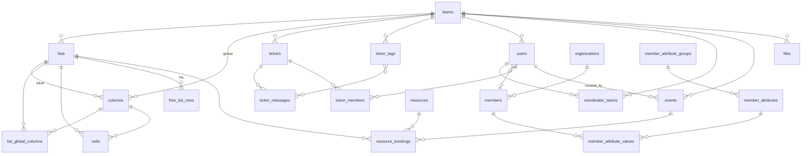

# Team Manager

Mobile-first Webanwendung zur Verwaltung von Sportteams. Koordinatoren legen Listen mit frei definierbaren Spalten an, Mitglieder tragen ihre eigenen Daten ein, und eine Statistikseite fasst die Kennzahlen pro Mitglied zusammen.

Weitere Bausteine:

- **Inhalte** (Listen, Dokumente, Termine) in den Ansichten Übersicht, Monat und Liste, mit Token-geschütztem ICS-Abo für Gerätekalender. Listen und Termine lassen sich als Serie bis zu einem Enddatum anlegen.
- **Ressourcen** (Platz, Halle, Bus …) für alle Teams: Belegung durch Listen und Termine, Prüfung auf Überschneidungen vor dem Speichern, Auslastung und ein ICS-Abo je Ressource.
- **Termine durch Mitglieder:** pro Team freischaltbar.
- **Live-Ticker** mit öffentlicher Seite und Push-Benachrichtigungen.

**Stack:** PHP 8.3 · PostgreSQL 15 · Bootstrap 5 · kein Framework

---

## Datenmodell

Die Anwendung gliedert sich in fünf Bereiche: Teamverwaltung, Inhalte (Listen/Spalten/Zellen als EAV, Dokumente, Termine), Ressourcen, Live-Ticker und Mitgliedsprofile. Das Diagramm zeigt die wichtigsten Tabellen; die vollständige Liste steht in `CLAUDE.md`.


```mermaid
erDiagram
    teams ||--o{ lists : ""
    teams ||--o{ columns : "global"
    teams ||--o{ tickers : ""
    teams ||--o{ ticker_tags : ""
    teams ||--o{ users : ""
    teams ||--o{ coordinator_teams : ""
    teams ||--o{ events : ""
    teams ||--o{ files : ""

    users ||--o{ coordinator_teams : ""
    users }o--o| members : ""
    users ||--o{ ticker_members : ""

    organizations ||--o{ members : ""
    members ||--o{ member_attribute_values : ""

    member_attribute_groups ||--o{ member_attributes : ""
    member_attributes ||--o{ member_attribute_values : ""

    lists ||--o{ columns : "lokal"
    lists ||--o{ list_global_columns : ""
    lists ||--o{ cells : ""

    columns ||--o{ list_global_columns : ""
    columns ||--o{ cells : ""

    lists ||--o{ free_list_rows : "frei"

    resources ||--o{ resource_bookings : ""
    lists ||--o{ resource_bookings : ""
    events ||--o{ resource_bookings : ""
    users ||--o{ events : "created_by"

    tickers ||--o{ ticker_messages : ""
    tickers ||--o{ ticker_members : ""
    ticker_tags }o--o{ ticker_messages : ""
```

| Relation | Beschreibung |
|----------|-------------|
| `teams → users` | Ein Team hat mehrere Koordinatoren und Mitglieder; `users.team_id` gibt das Ursprungsteam an. |
| `teams → coordinator_teams ← users` | Koordinatoren können mehreren Teams zugeordnet sein; `coordinator_teams` ist die Wahrheitsquelle für aktive Zugehörigkeiten. |
| `users → members` | Jeder Benutzeraccount ist mit einem dauerhaften Mitgliedsprofil verknüpft, das teamübergreifend gültig ist. |
| `organizations → members` | Ein Verein bündelt Mitglieder; ein Mitglied gehört optional zu genau einem Verein. |
| `teams → lists` | Ein Team verwaltet beliebig viele Listen (z. B. Trainings, Spiele). |
| `lists → columns (lokal)` | Lokale Spalten (`columns.list_id IS NOT NULL`) gehören ausschließlich zu einer Liste und können vom Typ Text, Zahl oder Ja/Nein sein. |
| `teams → columns (global)` | Globale Spalten (`list_id IS NULL`) stehen teamweit zur Verfügung; Systemspalten (`team_id IS NULL`, `is_system = TRUE`) gelten für alle Teams. |
| `list_global_columns` | Steuert, welche globalen/System-Spalten in welcher Liste aktiv sind; Entfernen löscht die zugehörigen Zellen. |
| `lists + columns → cells` | Speichert EAV-Werte: eine Zeile pro (Liste, Spalte, Mitglied); der Wert wird als `TEXT` abgelegt und per `data_type` interpretiert. |
| `lists → free_list_rows` | Freie Listen haben eigene, frei benannte Zeilen statt Mitgliedern; ihre Zellen hängen an `free_list_rows.id`. |
| `teams → events` | Termine eines Teams (ohne Spalten). `created_by` merkt, wer ihn angelegt hat; Mitglieder dürfen das nur, wenn `teams.members_create_events` gesetzt ist. |
| `teams → files` | Markdown-Dokumente eines Teams. |
| `resources → resource_bookings ← lists / events` | Ressourcen pflegt der Admin für alle Teams. Eine Belegung verbindet eine Ressource mit genau einer Liste oder einem Termin; die Zeit kommt aus Datum und Uhrzeit des Eintrags. |
| `teams → tickers` | Ein Team kann mehrere Live-Ticker führen (z. B. pro Spiel). |
| `tickers → ticker_messages` | Nachrichten werden chronologisch einem Ticker zugeordnet und können optional einen Tag tragen. |
| `tickers → ticker_members ← users` | Steuert, welche Mitglieder Schreibzugriff auf einen Ticker haben. |
| `member_attribute_groups → member_attributes → member_attribute_values ← members` | Flexible EAV-Erweiterung des Mitgliedsprofils: Attributgruppen fassen Felder zusammen; Werte werden pro Mitglied gespeichert. |

---

## Dev-Umgebung (Docker)

### Voraussetzungen

- [Docker Desktop](https://www.docker.com/products/docker-desktop/) ≥ 4.x

### Starten

Einmalig die Konfiguration aus der Vorlage anlegen (`config.php` ist nicht im Repo; die Werte
kommen über `.env.docker`):

```bash
cp config.example.php config.php
```

```bash
docker compose --profile db up --build
```

Die Datenbank ist optional (Compose-Profil `db`). Ohne `--profile db` starten nur nginx und php;
die App verbindet sich dann mit `DB_HOST` aus der Env-Datei (siehe `docker-compose.yml`).

Die App ist danach unter **http://localhost:8080** erreichbar.

Beim ersten Start mit `--profile db`:
- PostgreSQL legt die Datenbank, das Schema `team_manager` und alle Tabellen mit RLS an
- Der App-Benutzer aus `DB_USER`/`DB_PASS` wird mit den nötigen Rechten angelegt
- Der Admin-Passwort-Hash wird automatisch aus `ADMIN_PASSWORD` generiert

Die Zugangsdaten kommen ausschließlich aus der Env-Datei (`APP_ENV_FILE`, Standard
`.env.docker`). `docker-compose.yml` liest bewusst keine DB-Werte per `${…}` ein: Compose lädt
automatisch eine `.env` aus dem Projektordner, und dort können Zugangsdaten einer anderen
Datenbank liegen (z. B. für das Shared Hosting). Enthält diese `.env` ein `$` (etwa im
Admin-Hash), meldet Compose „variable is not set" — harmlos, verschwindet aber erst, wenn die
Datei umbenannt wird.

### Login

| Rolle | Benutzername | Passwort |
|-------|-------------|---------|
| Admin | `admin` | `admin123` |
| Koordinator | (im Admin-Panel anlegen) | (im Admin-Panel setzen) |
| Mitglied | (vom Koordinator anlegen) | (vom Koordinator setzen) |

Admin-Zugangsdaten werden in [.env.docker](.env.docker) konfiguriert.

### Services

| Service | Image | Port |
|---------|-------|------|
| nginx | nginx:1.25-alpine | `APP_PORT` (8080) → 80 |
| php | php:8.3-fpm-alpine | intern (9000) |
| db | postgres:15-alpine | intern (5432), nur mit `--profile db` |

### Datenbank zurücksetzen

```bash
docker compose --profile db down -v && docker compose --profile db up
```

`-v` löscht das Postgres-Volume — die Initialisierungsskripte laufen beim nächsten Start neu durch.

### Konfiguration

Alle Umgebungsvariablen für die Dev-Umgebung stehen in [.env.docker](.env.docker), die für
Produktion in `.env.production` (Vorlage: [.env.production.example](.env.production.example)):

| Variable | Beschreibung | Standard |
|----------|-------------|---------|
| `APP_ENV_FILE` | Welche Env-Datei die Container bekommen (steht in der Datei selbst) | `.env.docker` |
| `APP_PORT` | Port auf dem Host | `8080` |
| `DB_HOST` | Datenbank-Host: `db` für den mitgelieferten Container, sonst der externe Host | `db` |
| `DB_PORT` | Datenbank-Port | `5432` |
| `DB_NAME` | Datenbankname | `team_manager_db` |
| `DB_SCHEMA` | PostgreSQL-Schema (mitgelieferte DB: immer `team_manager`) | `team_manager` |
| `DB_USER` | App-Datenbankbenutzer (kein Superuser, sonst greift RLS nicht) | `team_app` |
| `DB_PASS` | Passwort des App-Benutzers | `team_app_dev` |
| `POSTGRES_DB` / `POSTGRES_USER` / `POSTGRES_PASSWORD` | Nur mitgelieferte DB: Datenbank und Superuser des Containers | `team_manager_db` / `postgres` / `postgres` |
| `ADMIN_USERNAME` | Admin-Benutzername | `admin` |
| `ADMIN_PASSWORD` | Klartextpasswort (wird beim Start gehasht) | `admin123` |
| `APP_ENV` | Umgebung | `development` |
| `BASE_URL` | Adresse der App (für Links und Kalender-Abos) | `localhost:8080` |
| `MAIL_DRIVER` | E-Mail-Versand: `mail` (PHP mail()) oder `smtp` | `mail` |
| `MAIL_FROM_ADDRESS` | Absenderadresse | `noreply@localhost` |
| `MAIL_FROM_NAME` | Absendername | `Team Manager` |
| `MAIL_HOST` | SMTP-Host (nur bei `MAIL_DRIVER=smtp`) | — |
| `MAIL_PORT` | SMTP-Port (nur bei `MAIL_DRIVER=smtp`) | `587` |
| `MAIL_USERNAME` | SMTP-Benutzername (nur bei `MAIL_DRIVER=smtp`) | — |
| `MAIL_PASSWORD` | SMTP-Passwort (nur bei `MAIL_DRIVER=smtp`) | — |

### Datenbankstruktur

Der mitgelieferte DB-Container führt beim ersten Start (leeres Volume) in dieser Reihenfolge aus:

| Datei | Inhalt |
|-------|--------|
| `docker/postgres/01-user.sh` | Legt den App-Benutzer aus `DB_USER`/`DB_PASS` an |
| `database/schema.sql` | Erstellt Schema `team_manager` und alle Tabellen |
| `database/rls_policies.sql` | Aktiviert Row-Level Security mit Richtlinien auf allen Tabellen |
| `docker/postgres/04-grants.sh` | Erteilt dem App-Benutzer die Rechte aus `database/grants.sql` |

**Hinweis zur Row-Level Security:** Die App verbindet sich als `team_app` (kein Superuser), damit RLS greift. Admin-Requests setzen `app.is_admin = true`, Koordinator/Mitglied-Requests setzen `app.current_team_id`, `app.current_role` und `app.current_user_id`. Teamübergreifende Ansichten (Ressourcen-Auslastung, Ticker anderer Teams) lesen kurz im Admin-Kontext und stellen danach den Kontext der Rolle wieder her.

---

## Deployment (Hetzner Webhosting)

### Serverstruktur

```
~/                              (FTP-Home)
└── public_html/
    └── team-manager/           ← Subdomain-Webroot (alle Quelldateien liegen hier)
        ├── index.php           (aus public/)
        ├── .htaccess           (aus public/)
        ├── config.php          ← Zugangsdaten (einmalig anlegen, nie überschreiben)
        ├── src/
        ├── database/
        └── uploads/
```

### Ersteinrichtung

**1. Subdomain anlegen** (Hetzner Konsole) mit Webroot `public_html/team-manager/`.

**2. config.php anlegen** — per FTP nach `public_html/team-manager/config.php` hochladen und Zugangsdaten eintragen:

```php
<?php
define('ADMIN_USERNAME',     'admin');
define('ADMIN_PASSWORD_HASH', password_hash('IhrPasswort', PASSWORD_BCRYPT, ['cost' => 12]));

define('DB_HOST',   'localhost');
define('DB_PORT',   '5432');
define('DB_NAME',   'ihre_datenbank');
define('DB_SCHEMA', 'team_manager');   // Bestandsinstallationen können abweichen — siehe Hinweis unten
define('DB_USER',   'ihr_db_benutzer');
define('DB_PASS',   'ihr_db_passwort');

define('SESSION_TIMEOUT', 8 * 60 * 60);
define('APP_ENV', 'production');
define('BASE_URL', '');

define('MAIL_DRIVER',       'smtp');          // 'mail' oder 'smtp'
define('MAIL_FROM_ADDRESS', 'team@ihre-domain.de');
define('MAIL_FROM_NAME',    'Team Manager');
// Nur bei MAIL_DRIVER=smtp:
define('MAIL_HOST',     'mail.ihre-domain.de');
define('MAIL_PORT',     587);
define('MAIL_USERNAME', 'ihr-smtp-benutzer');
define('MAIL_PASSWORD', 'ihr-smtp-passwort');
```

> **Hinweis zu `DB_SCHEMA`:** `team_manager` ist nur der Standardwert für Neuinstallationen.
> Eine bestehende Produktionsinstallation kann ein anderes Schema verwenden — maßgeblich ist
> allein der Wert in der dortigen `config.php`. Vor jeder Schema-Änderung prüfen, welche
> Schemas überhaupt existieren:
> ```sql
> SELECT table_schema FROM information_schema.tables WHERE table_name = 'teams';
> ```

**3. Deployment konfigurieren** — `deploy.sh` liest seine Einstellungen ausschließlich aus
Umgebungsvariablen, niemals aus Kommandozeilen-Argumenten. Argumente wären für andere
Benutzer des Rechners via `ps` sichtbar und landen in der Shell-History.

Am einfachsten über eine Datei `.env.deploy` im Projektverzeichnis (ist in `.gitignore`
und wird nicht mit hochgeladen):

```bash
FTP_HOST=ftp.ihre-domain.de
FTP_USER=ihr-benutzer
FTP_DIR=public_html/team-manager
# FTP_PASS=...   # optional — ohne Eintrag wird verdeckt abgefragt
```

**4. Dateien hochladen:**

```bash
./deploy.sh
```

Erfordert `lftp`: `brew install lftp` (macOS) oder `apt install lftp` (Linux).

**5. Erste Anfrage** — beim ersten Seitenaufruf wird das Datenbankschema automatisch
angelegt (nur bei einer leeren Datenbank).

### Folge-Deployments

```bash
./deploy.sh
```

`config.php` wird nie überschrieben.

> **Wichtig:** Schema-Änderungen werden **nicht** automatisch angewendet. Die App führt zur
> Laufzeit keine Migrationen aus. Bringt eine Code-Version neue Spalten oder Richtlinien mit,
> müssen diese **vor** dem Deployment von Hand gegen die Produktionsdatenbank eingespielt
> werden — sonst greifen die neuen Handler auf Spalten zu, die es noch nicht gibt.
> Details unter [Datenbank-Änderungen](#datenbank-änderungen).

---

## Datenbank-Änderungen

Die App führt zur Laufzeit **keine** Migrationen aus. Beim ersten Seitenaufruf gegen eine
leere Datenbank wird das Schema aus `db_init_schema()` angelegt — das ist alles. Bestehende
Datenbanken werden nie automatisch verändert.

`database/schema.sql` und `database/rls_policies.sql` sind die Wahrheitsquelle für den
aktuellen Stand; `db_init_schema()`/`db_init_rls()` in `src/db/connection.php` legen dasselbe
in einer leeren Datenbank an. Alle drei werden bei einer Schema-Änderung im selben Commit
nachgezogen.

Eine Schema-Änderung kommt als Einmal-Skript nach `database/migrations/JJJJMMTT_thema.sql`.
Es wird **vor** dem Deployment von Hand gegen jede Umgebung eingespielt und danach im nächsten
Commit wieder gelöscht. Dauerhaft liegen also keine Migrationsskripte im Repository; der
Wortlaut eines eingespielten Skripts bleibt über die Git-Historie auffindbar.

Aufbau eines Skripts (Vorlage: ein beliebiges früheres Skript in der Git-Historie):

```sql
BEGIN;
SET LOCAL search_path TO SCHEMA_EINTRAGEN;   -- DB_SCHEMA aus der config.php
DO $$ BEGIN
    IF to_regclass('teams') IS NULL THEN RAISE EXCEPTION 'falsches Schema'; END IF;
END $$;
-- idempotente Änderungen: ADD COLUMN IF NOT EXISTS, DROP POLICY IF EXISTS + CREATE POLICY …
COMMIT;
```

Es ist reines SQL ohne `psql`-Befehle wie `\set`, damit es auch in pgAdmin (F5) läuft.

Beim Schreiben eines solchen Skripts zu beachten:

- **Schema-Name niemals raten.** In Produktion heißt das Schema `manager`, in Docker/Dev
  `team_manager` — und auf demselben Server liegen weitere Schemas (`flowy`, `flowy_new2`),
  die ebenfalls eine `teams`-Tabelle haben. Maßgeblich ist `DB_SCHEMA` aus `config.php`.
  Prüfen mit:
  ```sql
  SELECT table_schema FROM information_schema.tables WHERE table_name = 'teams';
  ```
  Das Skript setzt den Namen an genau einer Stelle per `SET LOCAL search_path TO <schema>;`
  und verwendet danach unqualifizierte Tabellennamen. Die Prüfung per `to_regclass` bricht
  ab, bevor etwas geändert wird, falls das Schema nicht stimmt.
- **RLS:** Jede Tabelle hat Row-Level-Security-Richtlinien, die
  `current_setting('app.is_admin', true) = 'true'` prüfen. Ändert ein Skript Daten, braucht es
  ein einleitendes `SET LOCAL app.is_admin = true;` — sonst betreffen `UPDATE`/`DELETE`
  kommentarlos 0 Zeilen. Reine Struktur-Änderungen (Spalten, Richtlinien) brauchen das nicht.
- **Rechte:** `ALTER`/`DROP` benötigen den Tabelleneigentümer; der App-Datenbankbenutzer
  hat diese Rechte nicht.
- **Transaktion:** GUI-Clients wie pgAdmin oder DBeaver fassen ein Skript oft in eine
  Transaktion ohne Auto-Commit. Das Skript läuft dann scheinbar durch, ohne dass etwas
  persistiert wird. Entweder `psql` verwenden oder das Skript mit `COMMIT;` abschließen.
- **Reihenfolge:** Erst einspielen, dann deployen. Umgekehrt greifen die neuen Handler auf
  Spalten zu, die noch nicht existieren — das Ergebnis sind HTTP 500 auf den betroffenen Seiten.

---

## Kalender-Abo (ICS)

Termine lassen sich in Apple Kalender, Google Calendar oder Outlook abonnieren. Der Feed ist
**nicht öffentlich**, sondern über ein Token in der URL geschützt: `/ics/{token}.ics`.

Pro Team existieren genau **zwei** Tokens, gespeichert auf der Tabelle `teams`:

| Token | Spalte | Sichtbarkeit |
|-------|--------|--------------|
| Koordinator-Feed | `calendar_token_coordinator` | Listen: öffentlich, geschützt und privat · Termine: geschützt und privat |
| Mitglieder-Feed | `calendar_token_member` | Listen: öffentlich und geschützt · Termine: nur geschützt |

Die Rolle ergibt sich ausschließlich daraus, **welche Spalte** auf das Token passt — sie kann
nicht über einen Request-Parameter beeinflusst werden.

Den Link findet man jeweils unten in der Monatsansicht (`/coordinator/lists?view=month`
bzw. `/member/lists?view=month`). Koordinatoren können beide Tokens unter „Mein Profil" neu erzeugen,
falls ein Link öffentlich geworden ist.

**Ressourcen** haben je einen eigenen Feed: `/ics/resource/{token}.ics` (Spalte
`resources.calendar_token`, beim ersten Aufruf der Auslastung erzeugt). Er enthält die
Belegungen aller Teams als „Team: Titel"; private Einträge erscheinen nur als „Belegt".
Den Link zeigt die Auslastungsseite, sobald eine Ressource ausgewählt ist.

> **Hinweis:** Die Tokens gelten teamweit, nicht pro Person. Ein erneuertes Token macht das
> Abo für **alle** Abonnenten dieses Feeds ungültig — alle müssen den Link neu eintragen.

---

## Ressourcen und Termine

**Ressourcen** legt der Admin unter Einstellungen → Ressourcen an (Name genügt); deaktivierte
Ressourcen sind nicht mehr auswählbar, ihre Belegungen bleiben gespeichert. Koordinatoren
wählen Ressourcen beim Anlegen einer Liste (auch für eine ganze Serie), in den
Listen-Einstellungen und bei Terminen. Die Belegungszeit ergibt sich aus dem Eintrag:
ohne Uhrzeit der ganze Tag, ohne Ende eine Stunde, Listen ohne Datum belegen nichts.
Überschneidungen werden schon im Formular angezeigt (`/…/resources/check`), sind aber erlaubt.
Die Auslastung aller Teams (`/coordinator/resources`, `/member/resources`) sehen alle
Angemeldeten; Einträge, die das eigene Team nicht sehen darf, heißen dort „Belegt".
Code: `src/db/resources.php`.

**Termine durch Mitglieder:** Koordinatoren schalten das unter Profil → Einstellungen →
Termine frei (`teams.members_create_events`, Standard aus). Mitglieder legen dann einzelne
Termine an (ohne Serie, immer für das ganze Team sichtbar) und bearbeiten oder löschen nur
ihre eigenen (`events.created_by`). Koordinatoren sehen, wer einen Termin angelegt hat, und
können alle ändern. Die Regeln stehen doppelt: in `src/db/events.php` und als RLS auf
`events` und `resource_bookings`.

---

## Installation auf dem Startbildschirm (PWA)

Die App liefert ein Web App Manifest (`public/manifest.webmanifest`) und einen Icon-Satz aus,
lässt sich also unter Android und iOS zum Startbildschirm hinzufügen und startet dann ohne
Browser-Leiste.

Der Service Worker (`public/sw.js`) ist bewusst minimal: Er macht die App unter Chrome/Android
per Button installierbar, zeigt ohne Netz eine Hinweisseite (`public/offline.html`) und
empfängt Push-Benachrichtigungen für Ticker. Seiten und Daten speichert er **nicht**
zwischen — Mitgliederdaten landen nie im Cache des Geräts, und nach einem FTP-Deployment
gibt es keine veralteten Stände. Nach Änderungen an `offline.html` die Cache-Version in
`sw.js` erhöhen.

Das VAPID-Schlüsselpaar für Push wird beim ersten Gebrauch erzeugt und in `settings`
(`vapid_keys`) gespeichert.

Icons werden aus einem Skript erzeugt und sind reproduzierbar:

```bash
php bin/generate-pwa-icons.php
```

---

## Deployment (Docker-Container)

Für Server-Umgebungen mit Docker-Unterstützung (VPS, Root-Server, etc.). Verwendet dieselbe `docker-compose.yml` wie die Dev-Umgebung — nur die Env-Datei wird ausgetauscht.

**Zwei Varianten, ein Compose-File:**
- **Mit eigener PostgreSQL** (`--profile db`, Abschnitte 1–6 unten) — nginx, php und db laufen zusammen
- **Mit externer Datenbank** (ohne Profil, z. B. Managed PostgreSQL beim Hoster) — nur nginx + php, `DB_HOST` zeigt auf die vorhandene DB → [direkt zu dieser Variante](#variante-externe-datenbank)

### 1. Konfigurationsdatei anlegen

Die Vorlage kopieren und mit Produktionswerten befüllen:

```bash
cp .env.production.example .env.production
```

Dann `.env.production` anpassen (Auszug):

```env
APP_ENV_FILE=.env.production   # muss so bleiben: damit bekommen die Container diese Datei

DB_HOST=db
DB_NAME=team_manager_db
DB_SCHEMA=team_manager
DB_USER=team_app
DB_PASS=sicheres-datenbankpasswort

POSTGRES_PASSWORD=sicheres-superuser-passwort

ADMIN_USERNAME=admin
ADMIN_PASSWORD=sicheres-adminpasswort   # wird beim Start automatisch gehasht
ADMIN_PASSWORD_HASH=                    # leer lassen wenn ADMIN_PASSWORD gesetzt

APP_ENV=production
BASE_URL=ihre-domain.de
```

**Sicherheitshinweis:** `.env.production` niemals in Git einchecken — steht bereits in `.gitignore`.

### 2. Starten

```bash
docker compose --profile db --env-file .env.production up -d --build
```

- `--profile db` startet die mitgelieferte PostgreSQL mit (ohne: externe Datenbank, siehe unten)
- `-d` startet im Hintergrund
- `--build` baut das PHP-Image neu (bei Updates notwendig)
- Beim ersten Start legt PostgreSQL automatisch Schema, App-Benutzer und Berechtigungen an

### 3. Port und HTTPS

Nginx hört standardmäßig auf Port `8080`. Für Produktion entweder den Port ändern oder (empfohlen) hinter einen Reverse Proxy stellen:

**Port direkt auf 80 umstellen** — in `.env.production`:
```env
APP_PORT=80
```

**Reverse Proxy (z. B. Caddy)** — Nginx intern lassen, Caddy übernimmt TLS:
```
ihre-domain.de {
    reverse_proxy localhost:8080
}
```

### 4. Datenbank-Backup

```bash
docker compose --profile db --env-file .env.production exec -T db pg_dump -U postgres team_manager_db > backup.sql
```

Wiederherstellen:
```bash
docker compose --profile db --env-file .env.production exec -T db psql -U postgres team_manager_db < backup.sql
```

### 5. Update einspielen

```bash
git pull
docker compose --profile db --env-file .env.production up -d --build
```

Das Postgres-Volume (`pgdata`) bleibt erhalten. Schema-Änderungen werden **nicht** automatisch
angewendet — nötige Schema-Anpassungen vorher von Hand einspielen (siehe Datenbank-Änderungen).

### 6. Logs

```bash
docker compose --profile db logs -f   # alle Services
docker compose logs -f php            # nur PHP-Fehler
docker compose logs -f nginx          # nur Nginx-Zugriffe
```

---

### Variante: Externe Datenbank

Wenn PostgreSQL bereits woanders läuft (Managed DB beim Hoster, eigener DB-Server, etc.) — nur nginx und php als Container starten, `db`-Service überspringen.

#### Datenbank einmalig einrichten

Einmalig gegen die externe DB ausführen, als Benutzer mit Rechten zum Anlegen von Schema und
Rollen (Eigentümer der Tabellen):

```bash
psql -h ihr-db-host -U ihr-admin -d ihre-datenbank -c "CREATE USER team_app WITH PASSWORD 'sicheres-datenbankpasswort';"
psql -h ihr-db-host -U ihr-admin -d ihre-datenbank -f database/schema.sql
psql -h ihr-db-host -U ihr-admin -d ihre-datenbank -f database/rls_policies.sql
psql -h ihr-db-host -U ihr-admin -d ihre-datenbank -v app_user=team_app -f database/grants.sql
```

| Schritt | Was er tut |
|-------|------------|
| `CREATE USER` | Legt den App-Benutzer an (Name und Passwort wie `DB_USER`/`DB_PASS`); kein Superuser, sonst greift RLS nicht |
| `database/schema.sql` | Erstellt Schema `team_manager` und alle Tabellen |
| `database/rls_policies.sql` | Aktiviert Row-Level Security |
| `database/grants.sql` | Erteilt dem App-Benutzer (`-v app_user=…`) die nötigen Rechte |

Beim Hoster lässt sich oft kein zusätzlicher Benutzer anlegen. Dann den vorhandenen
Benutzer als `DB_USER` eintragen und den ersten Befehl weglassen — er darf aber kein
Superuser sein. Ein anderer Schema-Name als `team_manager` erfordert angepasste Kopien von
`schema.sql`, `rls_policies.sql` und `grants.sql`.

#### Konfiguration

`.env.production` wie oben anlegen, `DB_HOST` auf den externen Host zeigen lassen
(`POSTGRES_*` entfällt):

```env
APP_ENV_FILE=.env.production
DB_HOST=ihr-db-host.beispiel.de
DB_PORT=5432
DB_NAME=ihre-datenbank
DB_SCHEMA=team_manager
DB_USER=team_app
DB_PASS=sicheres-datenbankpasswort

ADMIN_USERNAME=admin
ADMIN_PASSWORD=sicheres-adminpasswort
ADMIN_PASSWORD_HASH=

APP_ENV=production
BASE_URL=ihre-domain.de
```

#### Nur App-Container starten

```bash
docker compose --env-file .env.production up -d --build
```

Ohne `--profile db` startet kein `db`-Container; `php` verbindet sich mit `DB_HOST` aus `.env.production`.

#### Updates

```bash
git pull
docker compose --env-file .env.production up -d --build
```

Die externe Datenbank wird nicht berührt. Schema-Änderungen werden **nicht** automatisch
angewendet — nötige Schema-Anpassungen vorher von Hand einspielen (siehe Datenbank-Änderungen).

---

### Projektstruktur

```
public/             Webroot (index.php — Front Controller, .htaccess)
  css/app.css       Das einzige eigene Stylesheet (Tokens, siehe docs/UI-BASELINE.md)
  manifest.webmanifest  Web App Manifest (Installation auf dem Startbildschirm)
  sw.js, offline.html   Service Worker (Installation, Offline-Hinweis, Push) — ohne Seiten-Cache
  icons/            App-Icons (192/512/maskable/apple-touch)
src/
  admin/            Admin-Handler (Teams, Koordinatoren, Mitglieder, Klubs, Ressourcen, Einstellungen)
  auth/             Login, Logout, Session, Umleitung bei falscher Rolle
  coordinator/      Koordinator-Handler (Inhalte, Termine, Spalten, Mitglieder, Statistik, Dateien, Ticker, Ressourcen, Logo)
  member/           Mitglieder-Handler (Inhalte, Termine, Statistik, Dateien, Ticker, Ressourcen, Profil)
  public/           Öffentliche Ticker-Seiten (ohne Anmeldung)
  ics_token_handler.php     Token-geschützter ICS-Feed je Team (/ics/{token}.ics)
  ics_resource_handler.php  ICS-Feed je Ressource (/ics/resource/{token}.ics)
  db/               PDO-Verbindung + Schema-Initialisierung, fachliche Abfragen (Übersicht,
                    Termine, Ressourcen, Sichtbarkeit, Ticker, Statistik)
  templates/
    components/     Gemeinsame Bausteine (partials.php, Termin-Formular, Ressourcen-Auslastung)
    admin/          Admin-Templates
    coordinator/    Koordinator-Templates
    member/         Mitglieder-Templates
    public/         Öffentliche Ticker-Templates
    layout.php      Gemeinsames Layout aller Rollen (render_page)
    login.php       Login-Seite
  utils/
    calendar.php    Kalender-Hilfsfunktionen (Wochen-/Monatsgrenzen, ICS-Formatierung)
    csrf.php        CSRF-Token-Generierung und -Validierung
    helpers.php     Hilfsfunktionen (redirect, htmle, require_*)
database/           SQL-Schema und RLS-Richtlinien (Wahrheitsquelle); migrations/ nur vorübergehend
docs/               UI-Baseline (verbindlich für jede Frontend-Arbeit)
bin/                CLI-Hilfsskripte (z. B. PWA-Icon-Generierung)
docker/             Docker-Konfiguration (nginx, php, postgres)
landing/            Statische Produkt-Landingpage (nicht Teil der App)
uploads/            Logo-Uploads (per .htaccess kein HTTP-Zugriff)
config.example.php  Vorlage für config.php (App-Konfiguration, liest Umgebungsvariablen)
deploy.sh           Hetzner FTP-Deployment-Skript (Konfiguration per Umgebungsvariablen)
```
